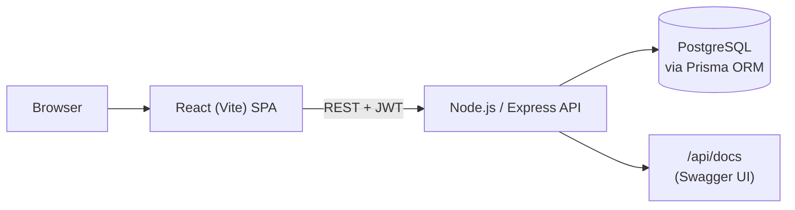
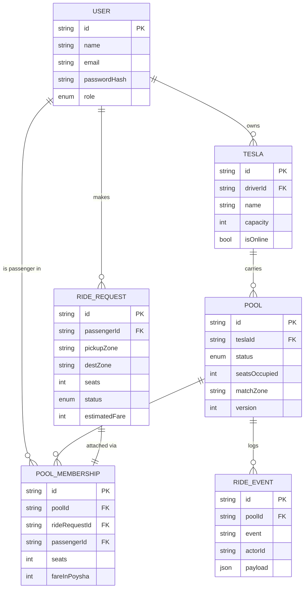

# Dhaka Tesla Pool

> Share a seat. Split the fare. Survive Dhaka traffic.

Ride-pooling MVP for Dhaka's unaffiliated three-seat electric-rickshaw fleet ("Teslas"),
built around the brief's own cast: **Jashim** drives **Bullet** (3 seats); **Nusrat**,
**Rafiq**, and **Shirin** are passengers competing for those seats during the Banani
rush-hour scenario.

## 1. Problem statement

Nusrat (Banani → Mohakhali) and Rafiq (Banani → Gulshan 1) book overlapping-but-not-identical
trips seconds apart. The system must decide, quickly and consistently, whether they can share
Jashim's Bullet, what each of them individually pays, and what happens when Shirin grabs the
last seat thirty seconds later. Passengers only ever see their own fare/status; the driver sees
who's assigned and what stage the ride is at; completed rides keep enough history to explain
themselves later.

## 2. Features implemented

- Passenger: register/login, request a ride (pickup, destination, seats), see an instant fare
  estimate, live status tracking (`REQUESTED → MATCHED → DRIVER_ARRIVED → STARTED → COMPLETED`
  / `CANCELLED`), ride history, cancel while still cancellable.
- Driver: login, own one or more Teslas with fixed capacity, go online/offline, see every pool
  matched to their Teslas with each passenger's seats and fare, advance ride status.
- Pooling: two+ compatible requests share one Tesla automatically; occupied seats never exceed
  Tesla capacity (enforced atomically — see §7); each pooled passenger gets a discounted,
  individually-computed fare.
- Full audit trail (`RideEvent`) per pool for post-hoc explanation.

## 3. Architecture



## 4. ERD



## 5. Tech stack & why (Section 7)

| Layer      | Choice                                       | Realistic alternatives       | Why this fits an MVP                                                                                                                                                                                                           | When I'd switch                                                                   |
| ---------- | -------------------------------------------- | ---------------------------- | ------------------------------------------------------------------------------------------------------------------------------------------------------------------------------------------------------------------------------ | --------------------------------------------------------------------------------- |
| Frontend   | React + Vite (plain SPA, `react-router-dom`) | Next.js (App Router)         | No SSR/SEO need for an internal ride app; Vite's dev loop is faster to iterate a small demo UI                                                                                                                                 | Next.js once there's marketing pages, SSR data needs, or a public landing site    |
| Backend    | Node.js + Express                            | NestJS, Fastify              | Express keeps the layering (routes/controllers/services) explicit and easy to explain line-by-line; no framework magic to defend in an interview                                                                               | NestJS if the team needs enforced module boundaries and DI at larger scale        |
| DB         | PostgreSQL                                   | MySQL, SQLite                | Relational + strong constraints fit seat-capacity/state-machine invariants; native `UPDATE ... WHERE` row locking is exactly what the concurrency problem (§12) needs                                                          | — already the right call for this domain                                          |
| ORM        | Prisma                                       | Sequelize, TypeORM, raw `pg` | Type-safe schema-as-code, `prisma migrate` gives a clean, inspectable migration history (Section 10 cares about history); raw SQL still reachable via `$queryRawUnsafe` for the one place it matters (atomic seat reservation) | Raw SQL/Knex if the query patterns got exotic enough that the ORM was fighting me |
| Auth       | JWT (`jsonwebtoken` + `bcryptjs`)            | Session cookies, OAuth       | Stateless, simple to demo via Swagger's bearer auth, no session store needed for an MVP                                                                                                                                        | Cookie-based sessions + refresh tokens for a real production consumer app         |
| Validation | Zod                                          | Joi, express-validator       | Schema + inferred types in one place, minimal boilerplate                                                                                                                                                                      | —                                                                                 |
| API docs   | swagger-jsdoc + swagger-ui-express           | Postman collection only      | Docs live next to the routes they describe and stay in sync; `/api/docs` is immediately explorable by an evaluator                                                                                                             | A dedicated OpenAPI-first spec file if the API grew multi-team                    |
| Testing    | Jest + Supertest                             | Mocha/Chai, Vitest           | One runner for unit + a DB-gated integration test proving the concurrency fix                                                                                                                                                  | —                                                                                 |
| Deployment | Docker Compose (local/reproducible)          | Railway/Render free tier     | Section 6 requires `docker compose up` to work regardless of hosting; free-tier PaaS was evaluated but not required for this submission — see §9                                                                               | Any free-tier PaaS with a managed Postgres, once a public URL is needed           |

## 6. Fare model (Section 5)

All money is stored as **integer poysha** (1 Taka = 100 poysha) — never as a float/decimal —
because floating-point arithmetic on money (`0.1 + 0.2 !== 0.3`) is exactly the kind of bug that
silently shortchanges a passenger. Every intermediate amount is rounded to the nearest poysha
before being summed, so the same inputs always produce the same fare, byte for byte.

```
passengerFare = baseFare + distanceCharge - poolDiscount
distanceCharge = round(perKmRate * distanceKm)
poolDiscount   = isPooled ? round(distanceCharge * 20%) : 0
```

- `baseFare` = 3000 poysha (৳30)
- `perKmRate` = 1500 poysha/km (৳15)
- `poolDiscount` = 20% of the distance charge, applied only once the pool has 2+ distinct
  passengers

**Worked example** — Nusrat, Banani → Mohakhali, pooled with Rafiq:

```
distanceKm(Banani, Mohakhali) = 1.6 km
distanceCharge = 1500 × 1.6            = 2400 poysha
poolDiscount   = 2400 × 20%            =  480 poysha
fare           = 3000 + 2400 - 480     = 4920 poysha = ৳49.20
```

An evaluator can reproduce this by hand from `src/utils/zones.js`'s lat/long table and the
formula above — no external map API involved.

**Matching rule (Section 4)**: two ride requests are poolable in the same Tesla when they share
the _exact same pickup zone_ and their destination zones are within **3 km** (straight-line) of
each other. Applied to the story: Nusrat and Rafiq both pick up in Banani, and
Mohakhali↔Gulshan 1 is ≈1.1 km apart → poolable. Shirin, arriving 30s later for the last seat,
either joins the same pool (if compatible and a seat is free) or triggers the concurrency path
below if she's racing Nusrat for the very last seat.

**Payment**: cash-only in this MVP (a `paymentMethod` field and simulated `TeslaPay` wallet
balance are natural next steps — see "Next improvements" below — but weren't required to
demonstrate the core pooling/fare logic).

## 7. Concurrency (Section 12)

**Scenario**: Bullet has 1 seat left. Nusrat and Shirin both call "claim the seat" at nearly the
same instant; both read `seatsOccupied = 2` (capacity 3) before either writes.

**Fix**: `reserveSeatsAtomically` (`src/services/poolService.js`) does the check-and-increment in
a single SQL statement:

```sql
UPDATE "Pool"
SET "seatsOccupied" = "seatsOccupied" + $seats, "version" = "version" + 1
WHERE id = $poolId AND "seatsOccupied" + $seats <= $capacity AND status IN ('REQUESTED','MATCHED')
RETURNING id;
```

Postgres takes a row lock for the duration of this statement, so two concurrent calls against
the same pool row serialize: whichever commits first wins and the row now reflects the new
`seatsOccupied`; the second statement re-evaluates the `WHERE` clause against the updated row,
finds it no longer satisfies `seatsOccupied + seats <= capacity`, and affects 0 rows. The API
treats "0 rows updated" as "pool full" and falls back to matching (or opening) a different pool
for the loser — nobody is overbooked, and nobody's request silently vanishes.

This is verified in `backend/tests/poolCapacity.integration.test.js`, which fires two concurrent
1-seat reservations at a pool with exactly one seat free and asserts exactly one succeeds and
`seatsOccupied` never exceeds `capacity`.

**At larger scale** I'd move this behind a proper reservation queue (or `SELECT ... FOR UPDATE`
inside a longer transaction that also handles payment authorization), so a losing request can be
requeued/retried automatically instead of the client re-requesting — see the bonus section.

## 8. Project structure

```
dhaka-tesla-pool/
  backend/
    prisma/            # schema.prisma, seed.js
    src/
      config/          # Prisma client
      controllers/      # auth, ride, driver
      docs/            # swagger.js
      middleware/       # auth, errorHandler
      routes/           # REST routes + OpenAPI JSDoc
      services/         # fareService, poolService, rideStateMachine
      utils/            # zones.js (distance/matching)
    tests/              # Jest: fare, state machine, concurrency
  frontend/
    src/
      api/client.js     # fetch wrapper + JWT storage
      pages/             # Login, Register, RequestRide, MyRides, DriverDashboard
  docker-compose.yml
```

## 9. Prerequisites

- Docker + Docker Compose (recommended path)
- Or locally: Node.js 20+, PostgreSQL 16

## 10. Local setup (Docker — recommended)

```bash
cp backend/.env.example backend/.env
cp frontend/.env.example frontend/.env   # optional, defaults work in compose
docker compose up --build
```

- API: http://localhost:4000 (health check: `GET /health`)
- Swagger docs: **http://localhost:4000/api/docs**
- Frontend: http://localhost:5173

The API container runs `prisma migrate deploy` then `prisma/seed.js` automatically on startup,
so the demo cast (Jashim/Nusrat/Rafiq/Shirin, Bullet) is ready immediately.

## 11. Local setup (without Docker)

```bash
# 1. Postgres running locally, then:
cd backend
cp .env.example .env        # point DATABASE_URL at your local Postgres
npm install
npx prisma migrate dev --name init
npm run seed
npm run dev                 # http://localhost:4000

# 2. In another terminal:
cd frontend
cp .env.example .env
npm install
npm run dev                 # http://localhost:5173
```

## 12. Tests

```bash
cd backend
npm test                    # fare, state-machine, and pool capacity concurrency unit tests (no DB needed)
DATABASE_URL=... npm test   # also runs the concurrency integration test against a real Postgres
```

Covers: Bullet's capacity can never be exceeded (concurrency unit & DB integration tests); invalid state transitions are
rejected (`rideStateMachine.test.js`); Nusrat/Rafiq's pooled fares calculate correctly
(`fareService.test.js`); ownership checks (`getRide`/`myPools` only ever return the caller's own
data — enforced in the controllers, exercised via the routes) and cancellation rules
(`cancelRideRequest` rejects cancelling a `STARTED` ride) live in the same services and are
covered by the state-machine tests above plus manual verification via Swagger.

## 12.1 Git Workflow & Branching Strategy

- **Long-Lived Branches**:
  - `master`: Primary development and integration branch
  - `pre-release`: Stabilization and pre-release verification branch
  - `release/v1.0.0`: Production-ready release branch
- **Feature Branches**:
  - `feature/*` (e.g., `feature/prd-compliance`, `feature/testing`, `feature/ride-lifecycle`)
- **Workflow**:
  - `feature branch` → `master` → `pre-release` → `release/v1.0.0`
- **Commit Convention**:
  - Follows `type(scope): description` format (e.g. `feat(pool): enforce seat capacity`, `test(pool): add last seat concurrency test`, `fix(ride): validate ride state transitions`, `docs(readme): update setup instructions`).

## 13. Demo credentials

All seeded users share the password `password123`:

| Name   | Email                | Role                             |
| ------ | -------------------- | -------------------------------- |
| Jashim | jashim@teslapool.dev | DRIVER (owns Bullet, capacity 3) |
| Nusrat | nusrat@teslapool.dev | PASSENGER                        |
| Rafiq  | rafiq@teslapool.dev  | PASSENGER                        |
| Shirin | shirin@teslapool.dev | PASSENGER                        |

## 14. API overview

Full interactive docs at `/api/docs`. Summary:

- `POST /api/auth/register`, `POST /api/auth/login`
- `GET /api/rides/zones` — valid zone names
- `POST /api/rides` (passenger) — request a ride (attached to a candidate pool, waiting for driver acceptance)
- `GET /api/rides`, `GET /api/rides/:id`, `POST /api/rides/:id/cancel` (passenger, own rides only)
- `GET /api/driver/teslas`, `POST /api/driver/teslas/:id/online` (driver, own Teslas only)
- `GET /api/driver/pools`, `POST /api/driver/pools/:id/status` (driver, own Teslas only)

## 15. Key decisions & trade-offs

- **Pool-of-one model**: every ride, pooled or not, is a `Pool` row. This keeps seat accounting
  and the state machine in exactly one place instead of branching solo vs. pooled logic.
- **Atomic UPDATE over pessimistic locking**: chosen for simplicity and because it needs no extra
  transaction-isolation tuning; documented trade-off in §7.
- **Zone-to-zone haversine distance instead of a routing API**: deterministic, offline, and
  matches Section 4's explicit instruction not to fight map APIs.
- **Fare recalculation on join**: when a second passenger joins a pool, existing members' fares
  are recalculated to the pooled rate inside the same DB transaction as the join, so the pool
  discount always reflects current membership.

## 16. Known limitations

- Matching is a linear scan over open pools — fine at demo scale, would need a spatial/index
  query at real scale (see bonus).
- No payment gateway (cash/simulated wallet only, per brief).
- No push/websocket updates — frontend polls every 4s for status changes.
- Single Tesla per pool only (no cross-Tesla re-pooling mid-ride).

## 17. Next improvements

- Real-time status via WebSockets/SSE instead of polling.
- TeslaPay simulated wallet + ledger.
- Rating/review after `COMPLETED`.

## 18. Bonus — scaling to 1M passengers / 100k drivers

Not built (keeps the MVP honest to Section 3's scope), but reasoned through:

- **Read/write split**: Postgres primary + read replicas for ride-history/lookup traffic;
  writes (seat reservation, status transitions) stay on the primary where row locks live.
- **Geospatial matching**: replace the zone-list scan with PostGIS (`ST_DWithin`) or a
  geohash/H3-indexed lookup so "compatible open pools near me" is an index scan, not O(n).
- **Queue-based matching**: move `matchRideRequest` off the request/response path into a
  worker consuming a queue (SQS/RabbitMQ/Kafka) per pickup-zone shard, so seat contention is
  resolved by one consumer per shard instead of N racing HTTP requests.
- **Caching**: cache "online Teslas per zone" in Redis with short TTL/invalidation on
  online/offline toggles, to avoid hitting Postgres for every match attempt.
- **Idempotency**: idempotency keys on `POST /rides` and status transitions so client retries
  during flaky mobile networks can't double-create rides or double-charge.
- **Rate limiting**: per-user and per-IP limits on ride creation/cancellation to blunt abuse.
- **Real-time**: WebSocket/SSE gateway (horizontally scaled, backed by a pub/sub layer like
  Redis) for live driver-location and ride-status pushes instead of polling.
- **Observability**: structured logs + request tracing (correlation ID per ride lifecycle),
  metrics on match latency and pool-fill rate, alerting on match failures.
- **Load balancing / horizontal scaling**: stateless API behind a load balancer, autoscaled on
  CPU/queue depth; DB connection pooling (PgBouncer) so scaling API pods doesn't exhaust Postgres
  connections.
- **Retry/failure strategy**: exponential backoff + circuit breaker around the matching path;
  failed matches fall back to a "still searching" state visible to the passenger rather than a
  hard error.
- **Security at scale**: rotate JWT signing keys, short-lived access tokens + refresh tokens,
  audit logging on driver status changes, WAF/rate limiting at the edge.

## 19. AI usage (Section 8)

- **Tools used**: Claude, for scaffolding the Express/Prisma project structure, the Swagger
  annotations, and drafting this README from the PRD.
- **Accepted suggestion**: doing the seat check-and-increment as a single atomic `UPDATE ...
WHERE` statement rather than a `SELECT` followed by an `UPDATE` inside a transaction — simpler
  to reason about and to unit-test than manual row locking.
- **Rejected/changed suggestion**: the first draft suggested storing fares as `Decimal`/float
  Taka amounts for readability. Rejected in favor of integer poysha end-to-end (see §6) to
  eliminate rounding-error risk in pooled-fare recalculation, at the small cost of dividing by
  100 for display.

## 20. Demo video

_Add your Loom/6-minute video link here before submission._
